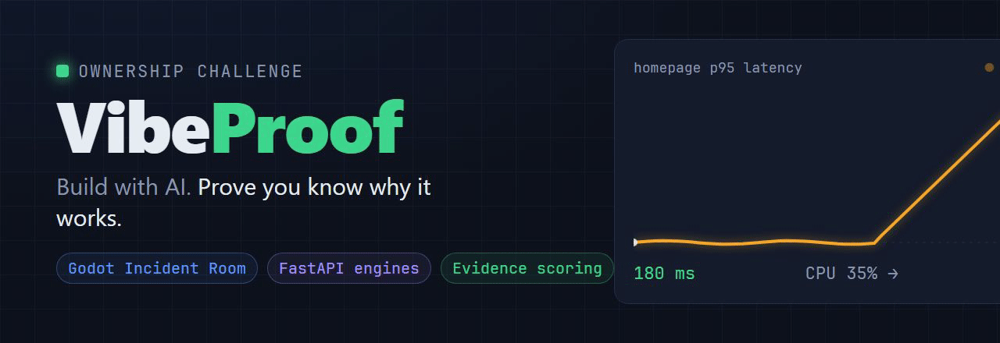
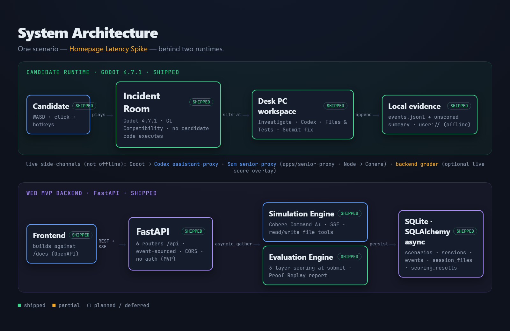
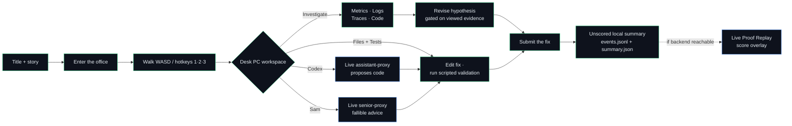
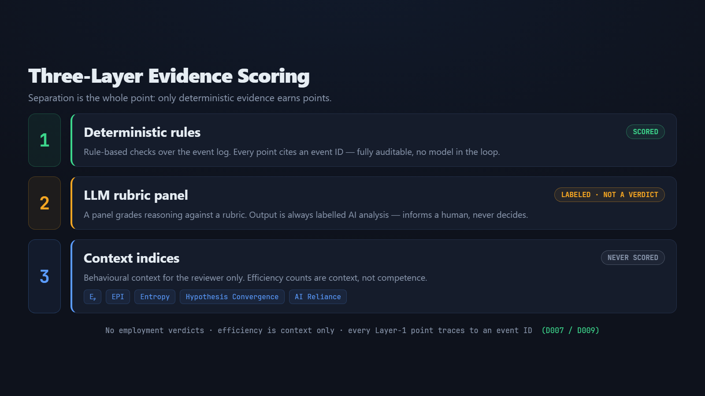
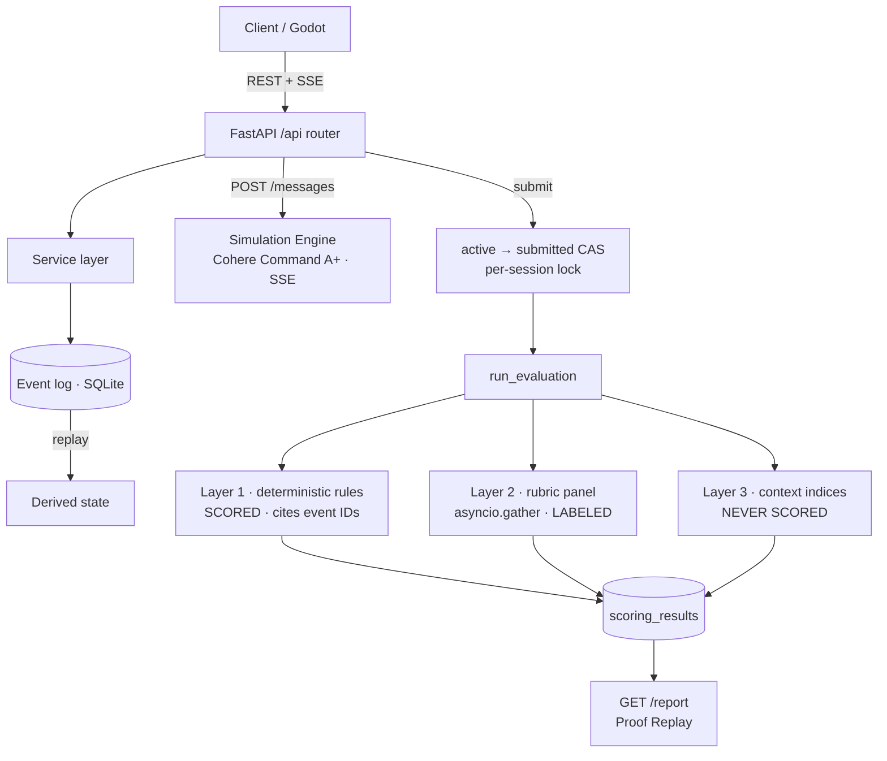

<div align="center">



<h1>VibeProof</h1>

<b>Build with AI. Prove you know why it works.</b>

<p>An AI-allowed engineering assessment. A candidate walks into a 3D incident room, debugs a real latency spike with metrics, logs, code, tests and an AI pair — and the platform records <i>observable evidence</i> of how they think, then produces a <b>Proof Replay</b> for a human reviewer.</p>

<p>


</p>

<sub><a href="https://vibeproof-web-production.up.railway.app">▶ Play the browser build</a> · <a href="docs/README.md">Documentation</a> · <a href="#-getting-started">Getting started</a> · <a href="#-what-is-actually-built-verified">Verified status</a></sub>

</div>

---

> **What this repo is.** A 3-day hackathon MVP with two real runtimes over one scenario: a **Godot 4.7.1** candidate game (`apps/incident-room`) and a **FastAPI** backend (`backend/`) that runs the Simulation and Evaluation engines. This README was reconciled against the code — every "shipped" claim below points at a source file, and a [Designed, not built](#designed-not-built-honest-list) section names what is still only on paper.

## Table of contents

- [The problem](#the-problem)
- [What VibeProof does](#what-vibeproof-does)
- [Architecture](#architecture)
- [The candidate journey](#the-candidate-journey)
- [How it's assessed — three layers](#how-its-assessed--three-layers)
- [What is actually built (verified)](#-what-is-actually-built-verified)
- [Tech stack](#tech-stack)
- [Getting started](#-getting-started)
  - [Run the Godot app](#1-run-the-godot-incident-room-candidate-app)
  - [Run the backend](#2-run-the-fastapi-backend)
  - [Optional: senior-proxy & README media](#optional-services)
  - [Sample data (the scenario)](#sample-data-the-scenario)
- [Repository layout](#repository-layout)
- [Tests](#tests)
- [Built with Codex (GPT-5.6)](#built-with-codex-gpt-56)
- [Responsible-assessment boundary](#responsible-assessment-boundary)
- [Team](#team)

## The problem

Hiring engineers in the AI era is broken at both ends. Ban AI in the interview and you measure a world that no longer exists. Allow AI and the classic take-home tells you nothing — anyone can paste a passing solution they cannot explain.

The signal that actually predicts a good engineer is **ownership**: can they investigate an unfamiliar system, form and revise a hypothesis from evidence, use AI without being led off a cliff, and stand behind a fix? That is invisible on a pass/fail grader.

**VibeProof measures the investigation, not the answer.**

## What VibeProof does

VibeProof runs a short, realistic **Ownership Challenge** — the *Homepage Latency Spike*: p95 latency jumped from **180 ms → 850 ms** while CPU sits at a calm **35%**. The candidate:

1. explores metrics, logs, traces and source in a desk-PC workspace;
2. works with a live AI assistant (**Codex**) and a fallible senior colleague (**Sam**);
3. edits a fix and runs scripted validation tests;
4. submits — and the platform assembles a **Proof Replay** from the append-only event log.

Every scored point cites an **event ID**. AI output is always **labelled**, never a verdict. Time, prompt count and token count are **context, never competence**. No employment decision is ever made by the machine.

## Architecture

One scenario, two runtimes, one shared event vocabulary.



- **Candidate runtime** — the Godot 4.7.1 game. The candidate plays; every accepted action is schema-validated and appended to a local `events.jsonl`, and a final **unscored** summary is written to `user://`. *No candidate code is ever executed.* The game also opens three **live** side-channels (see the honesty note below).
- **Web MVP backend** — FastAPI with six `/api` routers, fully **event-sourced** over async SQLite (state is derived by replaying events — there is no current-state table). The **Simulation Engine** streams the assistant over SSE with `read_file`/`write_file` tools; the **Evaluation Engine** runs the three scoring layers at submit and builds the Proof Replay report.
- **senior-proxy** — a tiny zero-dependency Node service that fronts Cohere so the in-game "Sam" NPC has a live voice without leaking an API key to the client.

> ⚠️ **Honesty note (the app is *not* fully offline).** An earlier README described a purely offline prototype. That is no longer true: by default the game makes live network calls — `backend_grader.gd` → FastAPI grader, `ide_console.gd` → the Codex assistant-proxy, `office_layer.gd` → Sam. Only the **local event log + unscored summary + the scripted AI-disposition** are genuinely offline. The *no-code-execution* guarantee still holds.

## The candidate journey

The current, in-code flow (the *streamlined fix-first* design — the old "record an initial hypothesis" gate was removed and is unreachable in play):



Green = offline & local · blue = live network call.

## How it's assessed — three layers

The whole design rests on **provenance separation**: only deterministic, auditable evidence earns points; the LLM only ever *labels*; behavioural context is never scored. This is enforced *structurally* — `ScoringResult.layer` is an enum (`deterministic | llm_rubric | context_index`).



The backend request + scoring data-flow (verified in `backend/src/evaluation/service.py`):



| Layer | Verdict | What it is |
| --- | --- | --- |
| **1 — Deterministic rules** | **Scored** | Rule handlers over the event log (incl. graduated *Evidence Coverage* + *Verification Discipline*). Every result carries `evidence_refs` = event IDs. No model in the loop. |
| **2 — LLM rubric panel** | **Labelled, not a verdict** | Cohere grades 7 rubric dimensions (one `asyncio.gather` call each) + writes a narrative and 3–5 suggested interview questions. Opt-in Groq / NVIDIA NIM fallback. |
| **3 — Context indices** | **Never scored** | `Eₚ`, EPI, Investigation Entropy, Hypothesis Convergence, AI Reliance — behavioural context for the reviewer only (`report.py` hardcodes `scored: false`). |

## ✅ What is actually built (verified)

Reconciled against the source on 2026-07-18. Status is code-backed, not doc-backed.

**Shipped — backend (`backend/src/…`)**

| Capability | Evidence |
| --- | --- |
| SSE candidate chat, Cohere Command A+ (`command-a-plus-05-2026`) | `simulation/router.py` + `simulation/service.py` |
| Three-layer Evaluation Engine (rules + rubric + indices) | `evaluation/{rules,panel,indices,service}.py` |
| Layer 1 deterministic rules incl. Evidence Coverage / Verification Discipline | `evaluation/rules.py` (`rule_grade`) |
| Layer 3 context indices, never scored | `evaluation/indices.py`, `report.py:155` |
| Proof Replay recruiter report | `evaluation/report.py` → `GET /api/sessions/{id}/report` |
| Anti-forgery append-only event log (4-layer validation + per-session lock) | `events/service.py`, `event_log.py`, tested in `tests/test_concurrency.py` |
| Candidate-safe scenario redaction (root cause / rubric stripped) | `registry.py` + `tests/test_seed_guard.py` |
| Virtual Workspace file tools over DB rows (nothing executes) | `simulation/tools.py`, `workspace/router.py` |
| Opt-in true on-disk sandbox with **real `vitest run`** (`WORKSPACE_BACKEND=fs`) | `workspace/sandbox.py` · [ADR 0001](docs/decisions/0001-true-sandbox-for-interactive-cli.md) |
| 5 SQLAlchemy tables, event-sourced, idempotent seeding, uniform error envelope, CORS, no-auth | `models.py`, `registry.py`, `main.py`, `exceptions.py` |

**Shipped — Godot app (`apps/incident-room/…`)**

| Capability | Evidence |
| --- | --- |
| Playable game: title/story → office → desk-PC workspace | `scripts/presentation/{main,title_screen,browser_workspace,office_layer}.gd` |
| Movement (WASD + click-to-walk) + interaction (E, 1/2/3, H) | `scripts/presentation/player_controller.gd` |
| Scripted AI-suggestion disposition (Layer-1 scored event trio) | `scripts/domain/candidate_session.gd` |
| Hypothesis revision gated on viewed evidence | `candidate_session.gd` `revise_hypothesis()` |
| Structured final submission + scripted validation tests | `candidate_session.gd`, `workspace/service.py` |
| Append-only `events.jsonl` that **rejects** score/points/rank fields | `scripts/persistence/event_logger.gd`, `scripts/domain/event_schema.gd` |
| Persistence-fallback warning; unscored local summary | `event_logger.gd`, `scripts/domain/unscored_summary_builder.gd` |
| Cozy Toy Office visual overhaul (CC0 assets, animated NPC) | `scripts/presentation/office_layer.gd` |
| Live Sam (senior-proxy) + Codex (assistant-proxy) chat | `office_layer.gd`, `ide_console.gd`, `apps/senior-proxy/server.js` |

**Partial**

- Godot **Web export + Railway deploy** (`vibeproof-web`) — `build_web.ps1` exists; the live bundle was **not** re-verified in this audit.
- In-game dialogue box shipped; the **mute toggle + Kenney SFX** from the 2026-07-17 design are unconfirmed.
- The 6+3 scenario **scoring criteria** live in JSON but the Godot runtime never computes a score with them (scoring is intentionally backend-only).

<a id="designed-not-built-honest-list"></a>**Designed, not built (docs artifacts — do not mistake for features)**

- `AssessmentBackendClient` live-session integration (the 2026-07-17 *evidence-first* plan) — only in the plan doc; `backend_grader.gd` submit-time replay still exists.
- LLM **citation-provenance filtering** (`invalid_citation_count`, `prompt_version`) — absent from code.
- Frozen **evaluation regression corpus** (20–30 golden cases) — absent.
- *"Two Fallible Advisors"* **Case Board** fact-tagging, decoy evidence, and the `discernment` / `senior_guess_not_blindly_adopted` criteria — only the advisor *chat* exists; the grading redesign does not.

## Tech stack

| Layer | Choice | Why |
| --- | --- | --- |
| Candidate client | **Godot 4.7.1** (GL Compatibility) | Real 3D + a single-threaded Web export; GL Compatibility = no cross-origin-isolation headers needed in the browser |
| Backend | **FastAPI** + **SQLAlchemy async** on **SQLite** (`aiosqlite`) | Domain-per-package layout; SQLite → Postgres is a connection-string change |
| Orchestration | `asyncio.gather` fan-out | Rubric dimensions grade concurrently — **no LangGraph**, no framework tax |
| Assistant LLM | **Cohere Command A+** (`AsyncClientV2`) | One SSE tool-loop; Groq + NVIDIA NIM are opt-in fallbacks via an OpenAI-compatible base-URL swap |
| Transport | **SSE** for chat | Server-push tokens without WebSocket overhead |
| Sam's voice | **Node** zero-dep proxy | Keeps the Cohere key off the game client |
| README media | **Remotion** (React → PNG/GIF) | Diagrams-as-code; regenerate the hero + stills from source (`tools/remotion`) |

## 🚀 Getting started

**Prerequisites**

- **Godot 4.7.1 Standard** at `%LOCALAPPDATA%\VibeProof\Godot\4.7.1\Godot_v4.7.1-stable_win64.exe` — [download](https://github.com/godotengine/godot-builds/releases/tag/4.7.1-stable) (portable, unzip only).
- **Python 3.11+** for the backend.
- **Node 18+** (only for the optional senior-proxy and the Remotion media).

```bash
git clone https://github.com/mengfoong-dev/codex-candidate-assesment-system.git
cd codex-candidate-assesment-system
```

### 1. Run the Godot Incident Room (candidate app)

From the repository root (PowerShell). Import first — a clean checkout has no asset cache, so the first load *must* import before it runs:

```powershell
$godot = "$env:LOCALAPPDATA\VibeProof\Godot\4.7.1\Godot_v4.7.1-stable_win64_console.exe"

# import resources + generate script UID sidecars (run once after clone)
& $godot --headless --path apps/incident-room --import

# run the headless test suite  → expect "TESTS PASSED: 14 suites"
& $godot --headless --path apps/incident-room --script res://tests/run_tests.gd

# launch the game
& "$env:LOCALAPPDATA\VibeProof\Godot\4.7.1\Godot_v4.7.1-stable_win64.exe" --path apps/incident-room
```

Or the fail-fast one-shot (import → UID check → tests):

```powershell
powershell -NoProfile -ExecutionPolicy Bypass -File apps/incident-room/scripts/development/verify_project.ps1
```

**Controls:** `WASD` move · `E` interact · `1`/`2`/`3` open stations · `H` revise hypothesis · `Esc` close panel.

### 2. Run the FastAPI backend

```bash
cd backend
python -m venv .venv && .venv/Scripts/activate     # Windows; use  source .venv/bin/activate  on *nix
pip install -e ".[dev]"                            # (or:  uv sync  — a uv.lock is committed)
cp .env.example .env                               # engines degrade gracefully without keys; set COHERE_API_KEY for live chat/rubric
uvicorn src.main:app --reload
```

- **API docs (the frontend handoff):** http://localhost:8000/docs
- **Tests:** `pytest` → expect **75 passed, 1 skipped**.
- **Share on a LAN:** `uvicorn src.main:app --host 0.0.0.0 --port 8000` (see [`docs/backend/API_ACCESS.md`](docs/backend/API_ACCESS.md); there is **no auth** — LAN/demo only).

<a id="optional-services"></a>
### Optional services

<details>
<summary><b>Live "Sam" senior-proxy</b> (gives the in-game NPC a real LLM voice)</summary>

```bash
cd apps/senior-proxy
# set COHERE_API_KEY in the environment, then:
npm start        # node server.js — zero dependencies, Node 18+
```
</details>

<details>
<summary><b>End-to-end candidate CLI</b> (5-turn simulation against the real sandbox)</summary>

```powershell
# sets WORKSPACE_BACKEND=fs (real files + real vitest) and makes live Cohere calls
.\tools\run-interactive-simulation.ps1
```
</details>

<details>
<summary><b>Regenerate the README media</b> (hero GIF + diagram PNGs via Remotion)</summary>

```bash
cd tools/remotion
npm install
npm run render:all          # writes docs/media/{hero.gif,architecture.png,scoring.png}
npm run studio              # live-edit the compositions at http://localhost:3000
```
</details>

### Sample data (the scenario)

No fixtures to load — the sample data **is** the scenario, and it seeds itself.

- **`backend/data/scenarios/homepage_latency_v1.json`** — the frozen *Homepage Latency Spike* scenario (seeded system state, artifacts, hypotheses, remediations, rubric criteria). It is **byte-identical** to the Godot copy under `apps/incident-room/data/scenarios/`, so both runtimes assess the same incident.
- On backend startup, `seed_scenarios()` idempotently loads it into the `scenarios` table keyed by `scenario_id` + `version` (`backend/src/registry.py`); re-running never duplicates.
- Each new session seeds its **Virtual Workspace** — the buggy source the candidate inspects — as `session_files` rows. The candidate-safe view strips the root cause and rubric before anything reaches the client (`registry.py` `candidate_safe_view()`, guarded by `tests/test_seed_guard.py`).

A fresh `uvicorn` + a new session already has everything it needs. Nothing else to import.

## Repository layout

```
.
├── apps/
│   ├── incident-room/      # Godot 4.7.1 candidate game — scenes/ scripts/ data/ tests/
│   ├── senior-proxy/       # Node service: Sam's live LLM voice (fronts Cohere)
│   └── candidate-prompting-demo/
├── backend/                # FastAPI
│   ├── src/                # main·config·database·models·registry·schemas + 6 /api domain packages
│   ├── data/scenarios/     # frozen homepage_latency_v1.json (byte-identical to the game's copy)
│   └── tests/              # golden-fixture · contract · concurrency (75 passed)
├── docs/                   # product · assessment · backend contract · decisions · specs/plans
│   └── media/              # generated hero.gif + diagram PNGs (Remotion output)
├── tools/
│   ├── remotion/           # README media compositions (this repo's diagrams-as-code)
│   └── run-interactive-simulation.ps1
└── README.md
```

Start the docs at [`docs/README.md`](docs/README.md); settled product decisions live in [`docs/decisions.md`](docs/decisions.md), the frozen API contract in [`docs/backend/00-api-contract.md`](docs/backend/00-api-contract.md).

## Tests

| Suite | Command | Result |
| --- | --- | --- |
| Backend | `cd backend && pytest` | 75 passed, 1 skipped |
| Godot | `… --headless --path apps/incident-room --script res://tests/run_tests.gd` | 14 suites passed |
| senior-proxy | `cd apps/senior-proxy && npm test` | `node --test` |

## Built with Codex (GPT-5.6)

This MVP was built agent-first with **Codex (GPT-5.6)** driving a disciplined *spec → plan → execute → verify* loop, with every session time-logged. The full activity log lives in [`docs/hackathon/codex-usage/`](docs/hackathon/codex-usage/) — raw rows in `sessions.csv`, narrative in [`outcomes.md`](docs/hackathon/codex-usage/outcomes.md).

**Where Codex accelerated the workflow**

- **~39 tracked sessions over 3 days** (2026-07-14 → 07-16), auto-started/stopped by a lifecycle hook (`.codex/hooks.json` + `tools/codex-session.ps1`) so wall-clock time is *measured, not guessed*.
- **A design-doc + TDD plan per feature** before any code (`docs/superpowers/specs/` + `docs/superpowers/plans/`), so Codex executed against an approved contract instead of improvising.
- **Long autonomous implementation runs** — the Godot MVP implementation (171 min), the scaffold + scenario-loader checkpoint (91 min), and promoting the Godot project to the primary app path (61 min).
- **Whole-repo refactors** that are slow by hand — the VibeProof documentation migration + repository-wide reference update, and the `prototypes/godot-incident-room → apps/incident-room` promotion.
- **This README** — produced by auditing docs against the actual code with a parallel multi-agent workflow, then rendering the diagrams as code (Remotion GIF/PNG + native Mermaid).

**Where the key decisions were made**

| Decision | Recorded in |
| --- | --- |
| Product decisions D001–D009 (ownership over authorship, deterministic-first scoring, human-final decision, efficiency = context) | [`docs/decisions.md`](docs/decisions.md) |
| Opt-in true on-disk sandbox with real `vitest` (supersedes "nothing executes" for the CLI) | [ADR&nbsp;0001](docs/decisions/0001-true-sandbox-for-interactive-cli.md) |
| Backend architecture — `asyncio.gather` over LangGraph, 5-table event-sourced schema, Cohere primary + opt-in fallback | [backend MVP design](docs/superpowers/specs/2026-07-15-vibeproof-backend-mvp-design.md) |
| Godot-first **unscored** candidate flow, later streamlined fix-first | [godot-first design](docs/superpowers/specs/2026-07-15-vibeproof-godot-first-candidate-flow-design.md) · [fix-first design](docs/superpowers/specs/2026-07-17-streamlined-fix-first-flow-design.md) |

**How Codex + GPT-5.6 were used**

Spec authoring, TDD plan generation, GDScript + Python implementation, whole-repo migrations, and the docs-vs-code audit behind this README — all under human review, with decisions captured as ADRs/specs *before* execution. The signal for judges isn't prompt count; it's the chain:

```text
Problem framing → research validation → Ownership Challenge → observable candidate evidence → Proof Replay → human interview
```

## Responsible-assessment boundary

VibeProof records candidate actions, prompts, tests, decisions and responses to evidence. It does **not** claim access to private thoughts, does **not** reliably determine who authored code, and does **not** predict job performance without validation. Final hiring decisions remain with people; the prototype provides transparent evidence for a human reviewer and requires future reliability, fairness, accessibility and job-related validation before high-stakes use. (Decisions D006–D009.)

## Team

Sebastian · Meng Foong · Howard · Hao Xuen · Keng Loon

<sub>Engine: Godot Engine (MIT). Distributions must ship the engine's `THIRD_PARTY_NOTICES.md` and license files — see [`apps/incident-room/THIRD_PARTY_NOTICES.md`](apps/incident-room/THIRD_PARTY_NOTICES.md). In-game art is CC0. README media generated with Remotion.</sub>
