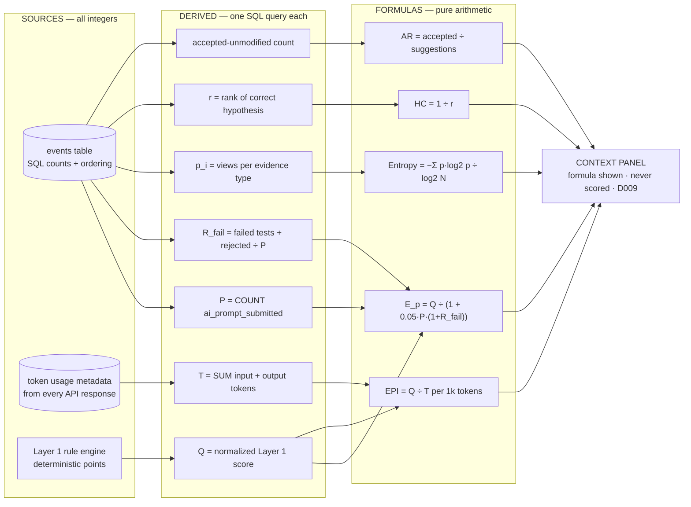

# Backend Brief 04 — Metrics, Formulas & Rubrics

> **For the executing agent:** the complete measurement catalog. Layer 1 items 10–11 and all of Layer 3 are pure functions over the event log — implement them in one module (`scoring/indices.py` suggested, ~100 lines total) with the exact input queries below. Layer 2 rubric anchors feed the panel in brief 01.

Terminology: `UBIQUITOUS_LANGUAGE.md`. Decision basis: D007 (deterministic first), D009 (efficiency = context, never competence).

## How every number is produced

No LLM judgment, no embeddings, no semantic analysis anywhere in this file's formulas. Two sources only:

1. **The events table** — SQL counts, orderings, and set intersections.
2. **Token usage metadata** — the `input_tokens`/`output_tokens` integers the LLM API returns with every response (billing metadata, a byte counter), stored on `ai_response_received.payload.usage`.

Plus one derived number: `Q` = the normalized Layer 1 deterministic total (itself rule points — still no LLM).

## Layer 1 additions (scored, deterministic)

### Evidence Coverage — `evidence_coverage` (0–10 points)

Detects **premature closure** — concluding before checking the key evidence — a validated construct in diagnostic-reasoning research.

$$EC = \frac{|E_{relevant} \cap V_{pre}|}{|E_{relevant}|} \qquad points = round(10 \cdot EC)$$

| Input | Computation |
|---|---|
| $E_{relevant}$ | `scenario.definition.relevant_artifact_ids` — pre-tagged: `metrics_overview`, `homepage_trace`, `homepage_orchestrator` |
| $V_{pre}$ | `SELECT DISTINCT payload.artifact_id FROM events WHERE event_type='evidence_viewed' AND sequence < (sequence of final_submission)` |

**Output:** EC ∈ [0,1] → 0–10 points, `evidence_refs` = the first viewing event of each covered artifact. **Pitfall:** the relevant set is scenario-author judgment — keep it minimal and defensible.

### Verification Discipline — `verification_discipline` (0–10 points)

Detects blind AI-acceptance; verification behavior is a recognized competence marker.

$$VD = \frac{N_{disp}^{verified}}{N_{disp}^{total}} \qquad points = round(10 \cdot VD)$$

| Input | Computation |
|---|---|
| $N_{disp}^{total}$ | count of `ai_suggestion_dispositioned` events |
| $N_{disp}^{verified}$ | those with option `verify_then_adapt`/`reject_suggestion` **or** followed (higher sequence, pre-submission) by a `test_executed` referencing the suggested remediation |

**Output:** VD ∈ [0,1] → 0–10 points; **`excluded` when $N^{total}=0$** (no AI suggestions ⇒ nothing to verify — not a penalty). **Pitfall:** gameable by throwaway tests; acceptable for MVP, noted in report limitations.

## Layer 3 — context indices (computed always, NEVER scored)

Shared guard: if `P_total == 0` (candidate never used the AI), skip E_p/EPI/AR, store `ai_used: false`, and the report shows "no AI assistance used" instead of numbers.

### 1. Prompt Efficiency Index — `e_p`

$$E_p = \frac{Q}{1 + \alpha \cdot P_{total} \cdot (1 + R_{fail})}, \quad \alpha = 0.05$$

| Input | Computation |
|---|---|
| $Q$ | Layer 1 normalized total ∈ [0,100] (nothing executes in this system, so "static analysis + test suites" from the original definition is impossible — the deterministic score is the honest quality measure) |
| $P_{total}$ | `COUNT(events WHERE event_type='ai_prompt_submitted')` |
| $R_{fail}$ | **proxy redefinition** (no compilation exists here): `(COUNT(test_executed WHERE payload.status='failed') + COUNT(ai_suggestion_dispositioned WHERE option='reject_suggestion')) / max(1, P_total)` |

**Output:** E_p ∈ (0, 100]. Higher = achieved quality with fewer, less-wasteful prompts. **Why context-only:** directly penalizes prompt volume — D009 forbids scoring it; legitimate iterative exploration would be punished.

### 2. Economical Prompting Index — `epi`

$$EPI = \frac{Q/100}{T / 1000}$$  (quality per kilotoken)

| Input | Computation |
|---|---|
| $Q$ | as above |
| $T$ | `SUM(payload.usage.input_tokens + payload.usage.output_tokens)` over `ai_response_received` events |

**Output:** quality-per-1k-tokens, unbounded above. **Pitfalls:** rewards not using AI at all (contradicts the AI-allowed philosophy) — one more reason it is display-only. The token-based E_p variant considered during kickoff was **rejected as a duplicate** of this index (same quality-÷-tokens shape).

### 3. Investigation Entropy — `investigation_entropy`

$$H_{norm} = \frac{-\sum_{i} p_i \log_2 p_i}{\log_2 N}$$

| Input | Computation |
|---|---|
| $p_i$ | share of `evidence_viewed` events per evidence type (`metrics`, `logs`, `trace`, `source_code`) |
| $N$ | 4 (evidence types in this scenario) |

**Output:** ∈ [0,1]; 1 = evenly spread investigation, →0 = tunnel vision on one panel. **Why context-only:** entropy cannot distinguish thorough from thrashing.

### 4. Hypothesis Convergence — `hypothesis_convergence`

$$HC = \frac{1}{r}$$

| Input | Computation |
|---|---|
| $r$ | 1-based position of `sequential_independent_calls` in the ordered list of distinct hypothesis IDs from `hypothesis_recorded`/`hypothesis_revised`; correct hypothesis never recorded → HC = 0 |

**Output:** ∈ {0} ∪ (0,1]. Adapted from Mean Reciprocal Rank in AIOps root-cause benchmarks. **Why context-only:** scoring it would punish legitimate differential diagnosis (testing 2–3 plausible hypotheses is good practice).

### 5. AI Reliance Ratio — `ai_reliance`

$$AR = \frac{N_{accept\_immediately}}{N_{disp}^{total}}$$

**Output:** ∈ [0,1]; high = tends to accept AI output unmodified. **Why context-only:** low AR may mean critical thinking *or* bad prompts — the number alone cannot tell; pairs with `verification_discipline` for the scored signal.

### 6. Raw counts (timeline context)

Prompts, total tokens, tool calls, distinct evidence artifacts viewed, investigation order, hypothesis count, iterations-until-solution, elapsed active time — plain aggregations displayed in the replay. Recorded, never scored in isolation (D009 verbatim).

## Layer 2 — rubric dimensions and anchors (LLM panel)

Scale 1–5 per dimension; anchors below are the 1 / 3 / 5 descriptions the grader prompt embeds. Grader output schema and panel mechanics: brief 01. `rubric_version: rubric_v1`.

| Dimension | 1 | 3 | 5 |
|---|---|---|---|
| `problem_framing` | restates the symptom number | separates symptom from constraint | frames symptoms, constraints, and success criteria before investigating |
| `investigation_strategy` | random panel-opening | mostly purposeful sequence | each evidence choice follows from the previous finding (eliminate-the-healthy-first) |
| `hypothesis_quality` | unsupported leap to a cause | plausible but untested | plausible, testable, explicitly tied to observed evidence |
| `evidence_use` | lists observations | links some evidence to the diagnosis | builds a connected chain: trace + code + metrics → conclusion |
| `prompt_precision` | vague "fix this" prompts | some context given | context-rich prompts with explicit constraints and expected form |
| `problem_decomposition` | one monolithic ask | partial breakdown | goal decomposed into 3–5 verifiable sub-asks |
| `communication_clarity` | conclusion without reasoning | reasoning without risks | evidence, risks, uncertainty, and rollback explained for a non-author reader |
| `thinking_style` | — narrative only, **never scored**: a 3–5 sentence description of investigation style (breadth-first vs depth-first, evidence-led vs AI-led). The "no right or wrong" profile. |

Deliberately absent (already deterministic in Layer 1, would double-count): AI verification, adaptability, technical conclusion.

## Research grounding (kickoff research agent, 2026-07-15)

- G-Eval rubric-based LLM scoring — [confident-ai.com guide](https://www.confident-ai.com/blog/g-eval-the-definitive-guide)
- Efficiency as a diagnostic axis, not a headline score: tau-bench `pass^k` ([guide](https://qaskills.sh/blog/tau-bench-agent-evaluation-guide-2026)), [TRAJECT-Bench](https://arxiv.org/html/2510.04550v1)
- MRR / top-k in AIOps root-cause analysis — [Groot](https://arxiv.org/pdf/2108.00344), [LEMMA-RCA](https://arxiv.org/pdf/2406.05375)
- Premature closure & anchoring bias — [AAFP](https://www.aafp.org/pubs/afp/issues/2011/1101/p1042.html), [Springer](https://link.springer.com/chapter/10.1007/978-3-319-93224-8_23)
- Process-data validity caveat (raw log indicators need validation before use as scores) — [Springer LSA](https://link.springer.com/article/10.1186/s40536-021-00113-5), [JEDM](https://jedm.educationaldatamining.org/index.php/JEDM/article/view/503)
- Information Foraging Theory (evidence-viewing patterns) — [NN/g](https://www.nngroup.com/articles/information-foraging/)

## Definition of done

- `scoring/indices.py` implements EC, VD, E_p, EPI, entropy, HC, AR with the exact input queries above; property: all outputs within documented ranges.
- Fixture tests: strong-session, tunnel-vision, blind-acceptance, and no-AI-used fixtures produce the documented values (hand-computed expected numbers in the test).
- Every stored index row's `detail` carries `{formula, inputs}` so the report can display the arithmetic.
